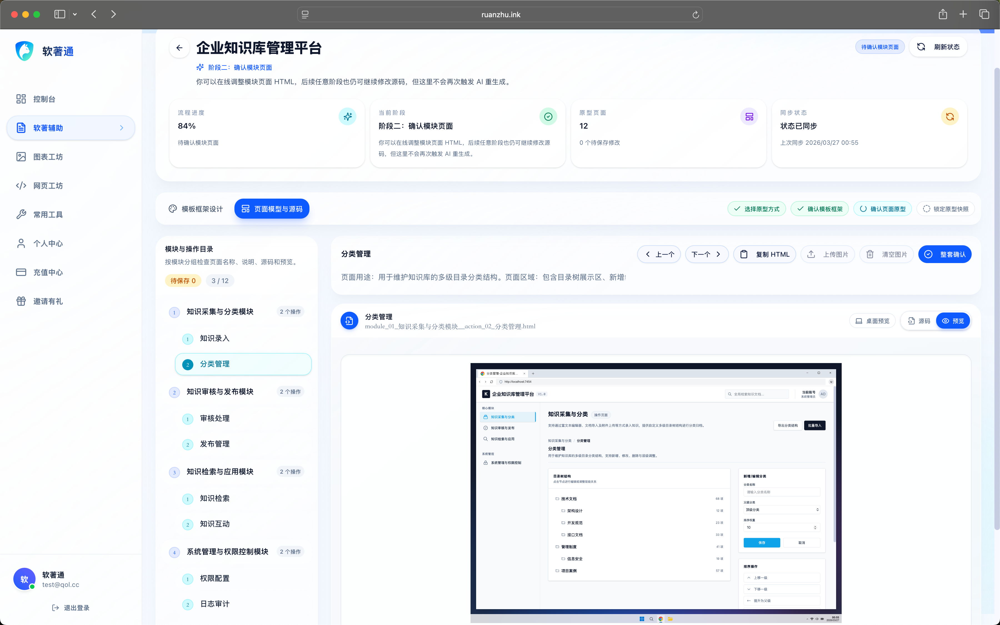
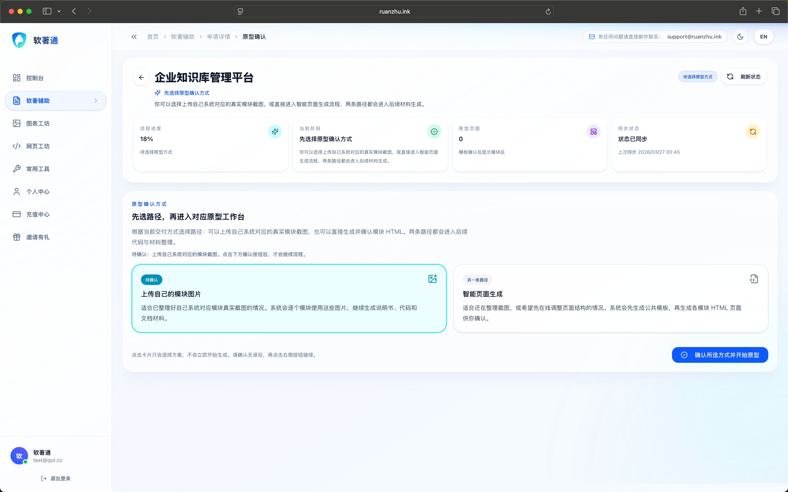
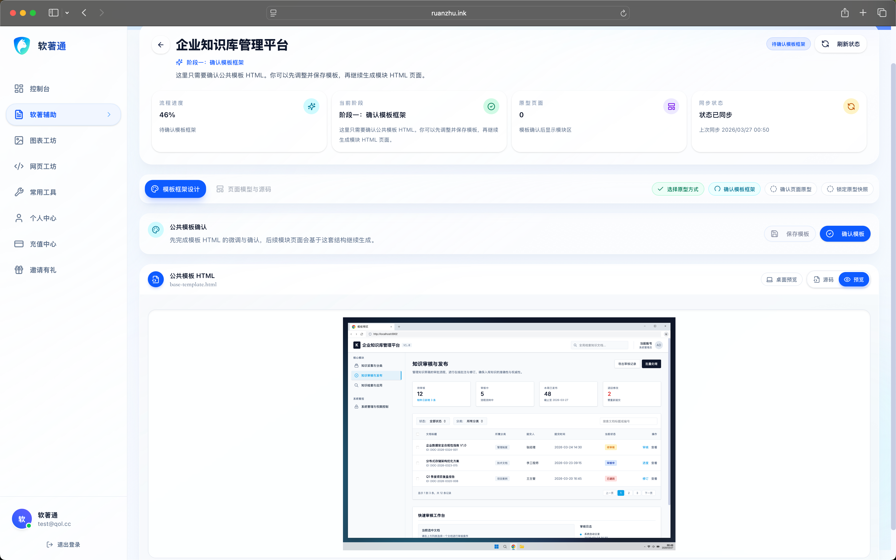
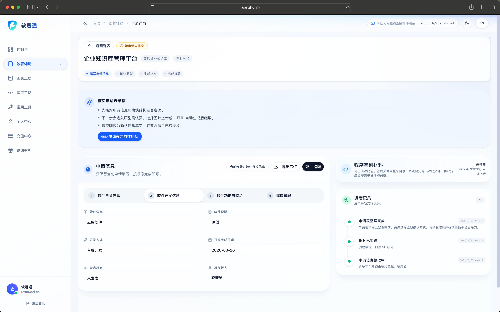
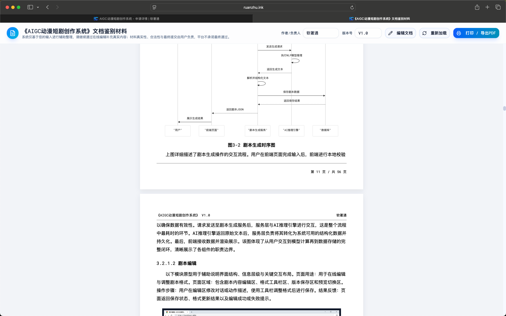
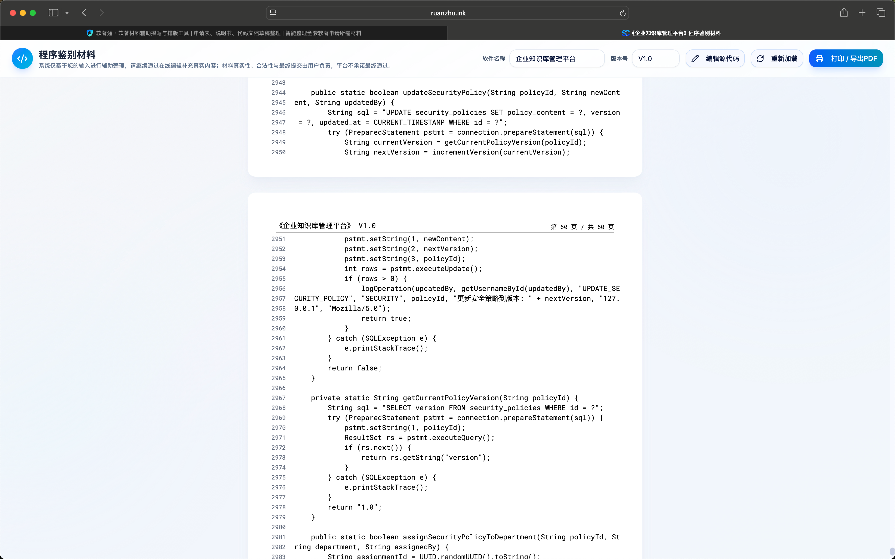

> 一句话描述软件，就能快速生成软著申请材料草稿。  
> 从首页引导、草稿确认、申请编辑到文档与代码导出，软著通把复杂流程收束成一个连续工作流。

# 软著通（RuanZhuTong）

[官网入口](https://www.ruanzhu.ink)  
[落地页教程](./docs/landing-page-tutorial.md)

## 项目概述

软著通是一款面向个人开发者、小团队和自由职业者的软著材料生成平台。
它的核心不是“再做一个表单”，而是把软著申请里最费时间的几件事串起来：

- 用一句项目描述快速创建申请草稿
- 在控制台持续补全申请信息和流程节点
- 生成并确认原型、模板、文档和代码材料
- 直接导出为可提交的软著申请材料

## 从截图看到的完整产品链路

### 1. 首页先解决“怎么开始”

首页强调一句话输入、快速辅助填写和透明交付承诺，适合第一次接触软著申请的用户快速进入任务。

当用户输入项目描述后，会弹出结果确认层，要求先核对软件全称、简称和主要功能，再进入正式申请流程。

### 2. 控制台负责承接后续所有动作

控制台首页把申请数据、最近申请和常用工具放进同一个工作台里，明显不是单次表单，而是一个持续使用的后台。

申请列表页承接搜索、筛选、批量建草稿和状态查看，是“持续管理申请”的主入口。

邀请有礼页面说明产品还带有增长和运营能力，不只是单点工具。

常用工具页则把网页工坊、图表工坊、协议文档、图片处理、PDF 转图等能力集中到一个工具箱里。

## 核心申请流程

### 1. 申请详情页

申请详情页用于填写申请信息、查看进度记录、进入编辑和导出流程，是整个软著流程的主控台。

### 2. 原型确认方式选择

在原型确认阶段，系统提供两条路径：

- 上传自己的模块图片
- 由系统智能生成页面

这个设计直接对应真实用户的两类工作习惯。

### 3. 公共模板确认

模板确认页用于确认公共模板 HTML，并作为后续真实模块页面生成的基础。

### 4. 页面模块与源码确认

页面模块确认页会把模块目录、分类结构、页面用途和 HTML 预览放到一起，便于逐步核查。

### 5. 文档材料导出

文档工作台支持在线编辑、重载和打印 / 导出 PDF，直接承接说明书交付。

### 6. 代码材料导出

代码工作台负责展示分页后的程序鉴别材料，同样支持重载与打印 / 导出 PDF。

## 工具生态

软著通不是只做软著申请表单，它还围绕“申请过程中的配套生产”扩展了工具生态。

### 图表工坊

图表工坊提供模板库、编辑画布和导出能力，适合补充说明书中的结构图、流程图和关系图。

### 网页工坊

网页工坊支持输入需求、实时预览、HTML 编辑和发布分享，适合快速生成演示页面或原型页。

## 从这些界面提炼出的产品价值

- 上手门槛低：首页直接承接“一句话输入”，适合不熟悉软著流程的用户。
- 工作流完整：从创建草稿到确认模板、编辑说明书、导出代码材料，都在一个系统里完成。
- 可持续管理：控制台、列表、进度记录和邀请体系说明这不是一次性页面，而是有留存能力的产品。
- 配套能力齐全：图表、网页、图片、PDF 等工具补足了材料准备中的高频辅助需求。

## 适合哪些用户

- 独立开发者：希望快速整理软著申请材料，不想从空白文档开始。
- 小型创业团队：需要把申请流程固化成一套可追踪的内部工作流。
- 自由职业者 / 服务商：希望提高交付效率，减少重复整理材料的时间。

## 如果你要继续做官网或落地页

建议先阅读这份文档：

- [落地页教程](./docs/landing-page-tutorial.md)

教程会把以上截图拆解成可直接用于官网落地页的模块、文案结构和实现顺序。
